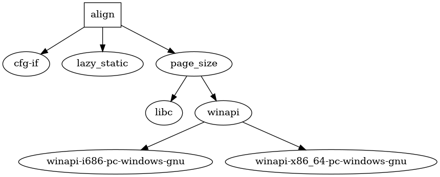

# `align` &ndash; strongly typed memory alignment guarantees

Some bytes just need to be aligned. Want to process bytes in batches of $8$ by interpreting them as `u64`? They must be $8$-byte aligned. Want to run SIMD operations on your bytes? You need to use special unaligned instructions and risk performance, or align them with target's requirements. Maybe your high-performance algorithm requires page alignment?

Validating that something is aligned is hard. `align` solves this problem by introducing strongly typed alignment types. To have your bytes aligned to a page boundary on the target architecture, all you need to do is:

```rust
use align::{alignment, AlignedBytes};

let bytes: [u8; 8] = [ 1, 2, 3, 4, 5, 6, 7, 8 ];
let aligned: AlignedBytes<alignment::Page> = bytes.into();
```

That's it. `AlignedBytes<A>` owns the bytes. By taking a reference you get `&AlignedSlice<A>`, which is basically the same as `&[u8]`, only that its alignment is guaranteed by the type.

## Unsafety

This crate needs to use `unsafe` code due to the low-level pointer-twiddling nature of the domain. Two places where `unsafe` is required are:

- creating the `AlignedBytes`, as it requires explicitly working with the allocator to get properly aligned bytes;
- converting between `AlignedSlice` and regular byte slices, which relies on `repr(transparent)` of the former to be `mem::transmute`-able into the latter.
- working internally on `AlignedBlock` to maintain the type's invariants.

Reviews via [cargo-crev](https://github.com/crev-dev/cargo-crev) are appreciated.

## Dependencies

Dependencies graph generated by `cargo-deps`:



Or as the output of `cargo tree`:
<!--cspell: disable -->
```plain
align v0.1.0
├── cfg-if v1.0.0
├── lazy_static v1.4.0
└── page_size v0.4.2
    └── libc v0.2.125
```
<!--cspell: enable -->
### Justification

- `cfg-if` &ndash; used to configure conditional compilation in a more readable manner, especially determining SIMD block size. It's lightweight and contains no unsafe code.
- `lazy_static` &ndash; used to lazily validate and cache the page size.
- `page_size` &ndash; used to get the page size for `alignment::Page`.

#### Dev

- `cargo-hack` &ndash; used for more robust testing by compiling and running the code for the feature powerset.

## `crev`

It is recommended to always use [cargo-crev](https://github.com/crev-dev/cargo-crev) to verify the trustworthiness of each of your dependencies, including this one. Reviews are appreciated.

To add me to your WoT trust my crev-proof repo:

```
cargo crev trust id https://github.com/V0ldek/crev-proofs
```